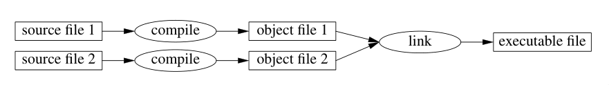

## Table of Contents
[]

## Overview of Chapter (2.1)
Aims:
    - Gives you an idea of what C++ is
    - Presents the notation of C++'s model of memory and computation and shows you how the basic tools needed to organize code into a program
    - All in all, we're covering *Procedural Programming*

Note: Throughout the book, you will see lots of aspects you you will *not* be familiar with, but with plenty of time using C++ you'll get the idea from what's covered.

# The Basics (2.2)
* For code to be run, it must be *compiled* 
    * Meaning that source code is processed by a compiler -> compiler produces object files -> object files are combined by a linker -> linker produces an executable program to be run.

In short:

* Executables are created for a specific hardware/system architecture (E.g x86, ARM), it's not mean to be portable.
    * But for C++ code (not executables) it can be *portable* it just has to be successfully compiled and and run on the other system. 
* C++ is a *statically typed language*, meaning that every entity (e.g objects, variables, values, expressions) must be known to the compiler when the source code is ready to be compiled.
    * There will be different sets of available operations for every other type of an object.

# 2.2.1 Hello World!
Go [here](programs/Hello-World.cpp)
